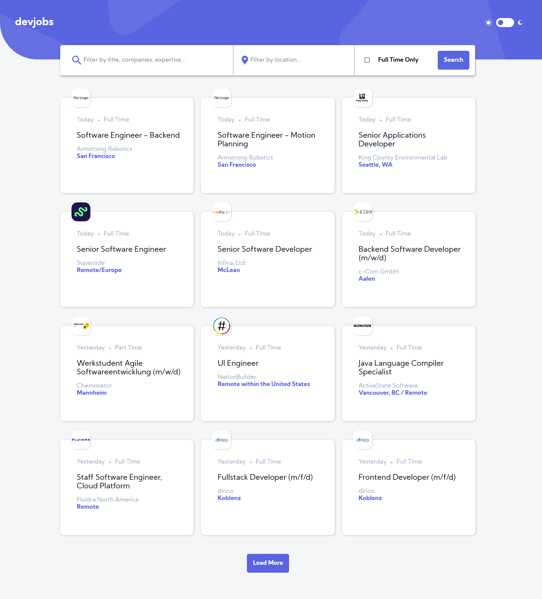
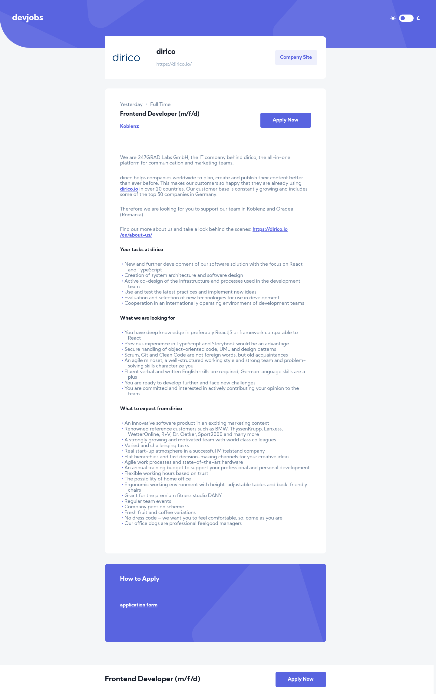
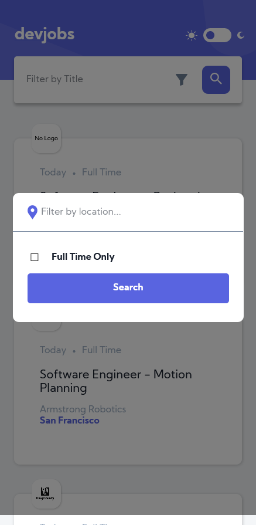
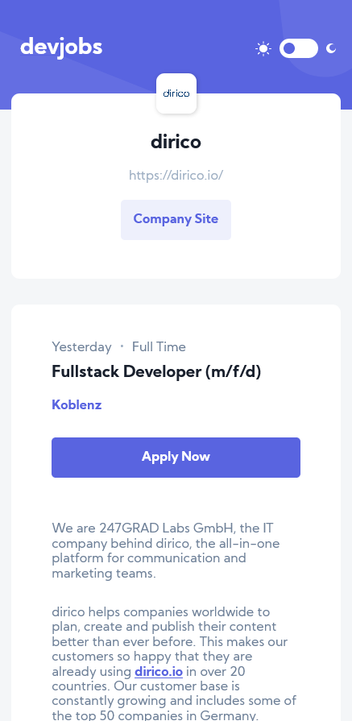

# Frontend Mentor - GitHub Jobs API solution

This is a solution to the [GitHub Jobs API challenge on Frontend Mentor](https://www.frontendmentor.io/challenges/github-jobs-api-93L-NL6rP). Frontend Mentor challenges help you improve your coding skills by building realistic projects.

## Table of contents

- [Frontend Mentor - GitHub Jobs API solution](#frontend-mentor---github-jobs-api-solution)
  - [Table of contents](#table-of-contents)
  - [Overview](#overview)
    - [The challenge](#the-challenge)
    - [Screenshot's](#screenshots)
    - [Links](#links)
  - [My process](#my-process)
    - [Built with](#built-with)
    - [What I learned](#what-i-learned)
    - [Continued development](#continued-development)
    - [Useful resources](#useful-resources)
  - [Author](#author)

## Overview

### The challenge

Users should be able to:

- View the optimal layout for each page depending on their device's screen size
- See hover states for all interactive elements throughout the site
- View all jobs currently live on the GitHub Jobs API
- Be able to click a job from the index page so that they can read more information and apply for the job
- **Bonus**: Have the correct color scheme chosen for them based on their computer preferences. _Hint_: Research `prefers-color-scheme` in CSS.

### Screenshot's






### Links

- Solution URL: [Frontendmentor.io solution](https://www.frontendmentor.io/solutions/github-jobs-api-using-react-and-redux-toolkit-IJFop1Gfj)
- Live Site URL: [Live Website](https://unruffled-joliot-4a7262.netlify.app/)

## My process

### Built with

- Semantic HTML5 markup
- CSS custom properties
- Flexbox
- CSS Grid
- [React](https://reactjs.org/) - JS library
- [Redux Toolkit](https://redux-toolkit.js.org/) - State management library
- [Styled Components](https://styled-components.com/) - For styles
- [Framer Motion](https://www.framer.com/api/motion/) - For animations

### What I learned

In this project i learned:

- How to make api calls using Redux Toolkit function, and handle paginated Api - createAsyncThunk (It is a function that accepts a Redux action type string and a callback function that should return a promise.)

```js
export const fetchJobList = createAsyncThunk(
  "jobs/fetchJobs",
  async (params) => {
    const response = await axios
      .get(proxy + url, {
        params: { ...params, page: 0 },
      })
      .then((res) => res.data)
      .catch((error) => error);
    return response;
  }
);
```

- how to handle different state's of fetch request to be able to display either loading spinner or Error if fetch request fails

```js
// pending action for fetcJobList thunk
        [fetchJobList.pending]: (state) => {
            state.jobsList = {
                status: 'loading',
                data: [],
                error: {},
            };
        },
        // fulfilled action for fetcJobList thunk
        [fetchJobList.fulfilled]: (state, action) => {
            state.jobsList.data = [];
            state.jobsList = {
                status: 'success',
                data: action.payload,
                error: {},
            };

            if (state.jobsList.data.length < 50) {
                state.isNextPage = false;
            } else {
                state.isNextPage = true;
            }
            state.searchParams.page = 2;
        },
        // error action for fetchJobList thunk
        [fetchJobList.rejected]: (state, action) => {
            state.jobsList = {
                status: 'error',
                data: [],
                error: action.payload,
            };
        },
```

- How to create dynamic routes using react router

```js
<Route path="/jobs/:id" exact>
  <JobsDetails />
</Route>
```

- How to reset scroll position when navigating to the page

```js
function ScrollToTopOnMount() {
  useEffect(() => {
    window.scrollTo(0, 0);
  }, []);

  return null;
}
```

```html
<main>
  <ScrollToTopOnMount />
</main
```

- How to conditionaly render Load More button, or spinner or display Error based on fetch call state.

```js
{
  MoreJobs.status === "idle" &&
    JobsList.jobsList.data.length > 0 &&
    (isNextPage ? (
      <CustomButton className="load-more-button" onClick={HandleLoadMore}>
        Load More
      </CustomButton>
    ) : (
      <CustomButton className="load-more-button" disabled>
        All Jobs Loaded
      </CustomButton>
    ));
}
{
  MoreJobs.status === "success" &&
    JobsList.jobsList.data.length > 0 &&
    (isNextPage ? (
      <CustomButton className="load-more-button" onClick={HandleLoadMore}>
        Load More
      </CustomButton>
    ) : (
      <CustomButton className="load-more-button" disabled>
        All Jobs Loaded
      </CustomButton>
    ));
}
{
  MoreJobs.status === "loading" && (
    <Loader
      className="center-load-more-spinner"
      type="TailSpin"
      color="#5964E0"
      height={100}
      width={100}
      timeout={10000} // 10 secs
    />
  );
}
{
  MoreJobs.status === "error" && (
    <h2 className="h2-searchactions">{MoreJobs.error}</h2>
  );
}
```

- How to write custom Hooks, this one below calculates days since the job was posted:

```js
function UseCalcDateDIff(date) {
  // parsing given date into miliseconds since year 1970
  const ParsedDate = Date.parse(date);
  // getting current date
  const CurrentDate = new Date();
  // getting miliseconds of new date since year 1970
  const ParsedCurrentDate = CurrentDate.getTime();
  // calculating difference, dividing by number of miliseconds in a day, and rounding up so end results is differnce in days.
  const NumOfDaysAgo = Math.round(
    (ParsedCurrentDate - ParsedDate) / (1000 * 60 * 60 * 24)
  );
  // conditionaly returning Date difference either us today, yestarday or num of days ago.
  if (NumOfDaysAgo === 0) {
    return "Today";
  }
  if (NumOfDaysAgo === 1) {
    return "Yesterday";
  }
  if (NumOfDaysAgo > 1) {
    return `${NumOfDaysAgo} day's ago`;
  }
}

export default UseCalcDateDIff;
```

and this is how you call it:

```js
//passing inside api response
const DaysPassed = UseCalcDateDIff(CurrentJob.created_at);
```

- How to use css repeat() and minmax() functions while working with css grid:

```css
grid-template-columns: repeat(2, minmax(300px, 1fr));
```

- How to use css Custom Properties(variables) and how easy it is to create light and dark mode with help of [attribute*=value] selector.

```css
body[data-theme='light'] {
    --color-primary: #5964E0;
    --color-primary-light: #939BF4;
    ...
    --searchbar-filter: #6E8098;
    --input-background-color: #E8E8EA;
  }
  body[data-theme='dark'] {
    --color-primary: #5964E0;
    --color-primary-light: #939BF4;
    ...
    --searchbar-filter: #FFFFFF;
    --input-background-color: #303742;
  }
```

- How to transform markdown data into Html to display it on a page using react-markdown lib:

```js
import ReactMarkdown from "react-markdown";
// It's that easy!
<ReactMarkdown source={CurrentJob.description} />;
```

- And many many more :)

### Continued development

On a future projects I would like to increase complexity, to make full use of redux library and polish my skills with it, and maybe connect my App to my own database.

### Useful resources

- [WesBos's eslint, prettier setup guide](https://github.com/wesbos/eslint-config-wesbos) - This helped me setup Eslint and preetier in my application
- [Youtube video](https://www.youtube.com/watch?v=xtD4YMKWI7w&ab_channel=Rowadz) - This is an amazing youtube tutorial on how to use redux toolkit, and createAsyncThunk function within it.
- [Redux Toolkit Docs](https://redux-toolkit.js.org/) - Everyone appreciates well writen doc's and redux toolkit doc's are definitly one of them. I really liked this pattern os setting up global state and will use it going forward.
- [React Router Doc's](https://reactrouter.com/web/guides/scroll-restoration) - Can't stress enought how much well writen doc's help in every developer's day to day work. Used them to setup router, create dynamic routes aswell as figure how restore scroll position while navigating between pages.

## Author

- Frontend Mentor - [@tosia921](https://www.frontendmentor.io/profile/tosia921)
- LinkedIn - [Tomasz Posiadala](https://www.linkedin.com/in/tomasz-posiada%C5%82a-3a05391b0/)
